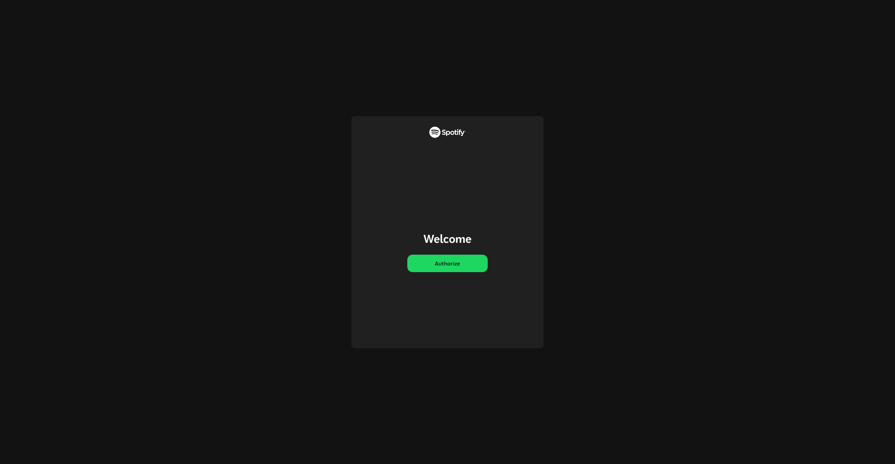
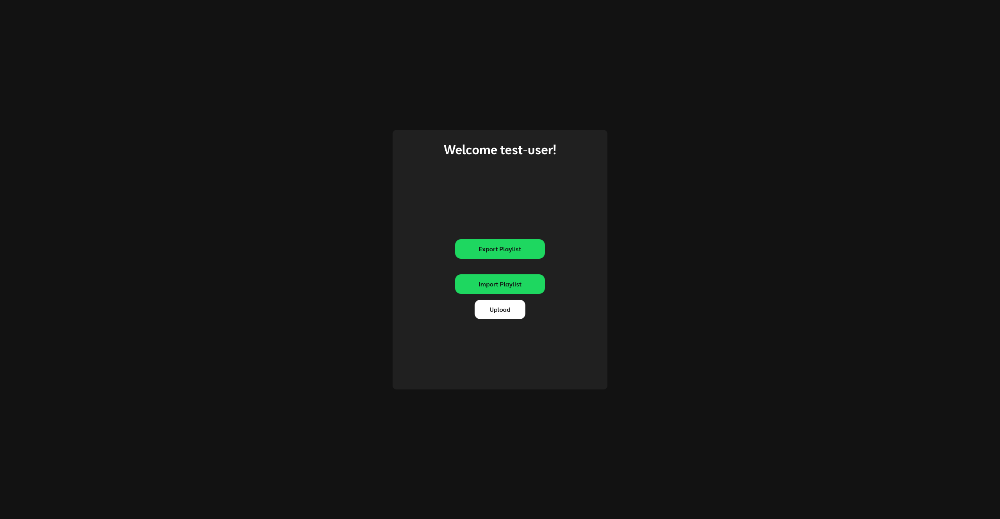
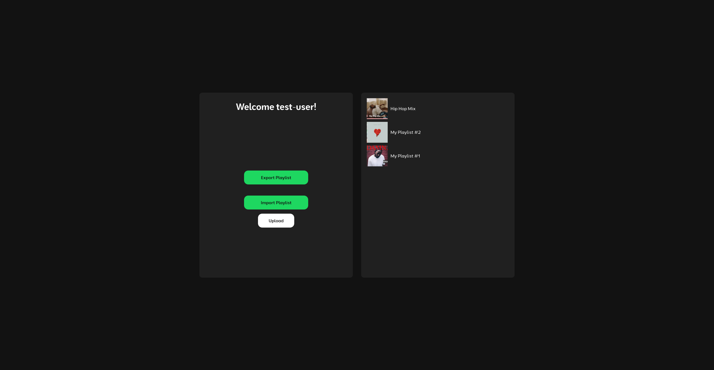
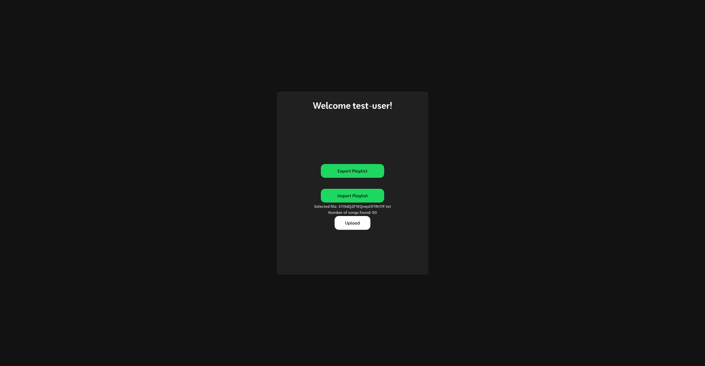
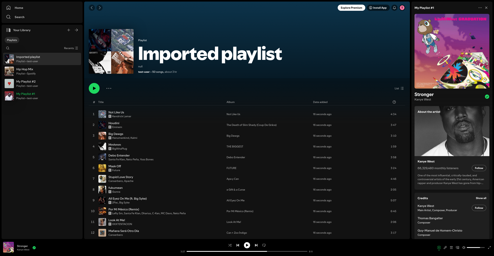

## Usage
### Setting up the application
1. Clone the repository:
   ```bash
   git clone https://github.com/yourusername/spotify-playlist-manager.git
   cd spotify-playlist-manager
   ```
2. Install dependencies: <br>
   Ensure you have Python and Flask installed. You can manually install Flask and other required libraries using:
   ```bash
   pip install flask requests
   ```
3. Create a Spotify app: <br>
   Visit this [link](https://developer.spotify.com/documentation/web-api/concepts/apps) and follow the instructions to create a Spotify app. <br>
   Set the `Redirect URI` to `http://localhost:5000/callback`.
4. Setting up the environment variables: <br>
   Create a `.env` file and set the following environment variables:
   ```env
   CLIENT_ID='your client id here'
   CLIENT_SECRET_ID='your client secret id here'
   ```
   Both can be found in your Spotify app dashboard.
5. Run the application:<br>
   ```bash
   python3 main.py
   ```

## Screenshots
When starting the flask app, you will be presented with the following screen.<br>


Once authorized with your account, the main dashboard will become visible. From here, you can either export your playlists to a .txt file or import playlists from a .txt file.<br>


You can click on the `Export Playlist` button to open a div where your playlists will be listed. Clicking on a playlist will download the contents of that playlist to a .txt file.<br>


This same `.txt` file can then be used to upload at a later time to recreate the exact same playlist.<br>


When you click the `Upload` button, the playlist will become visible in your Spotify account!<br>

